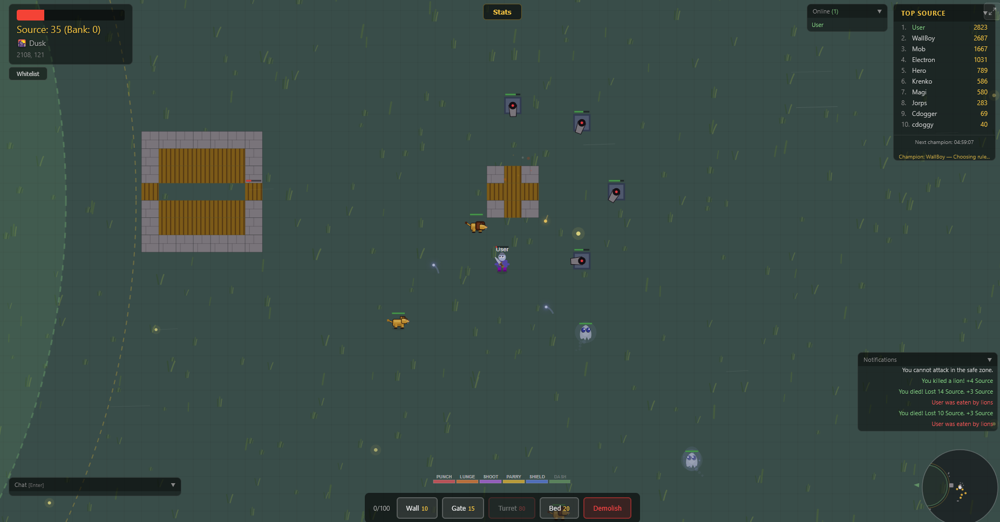
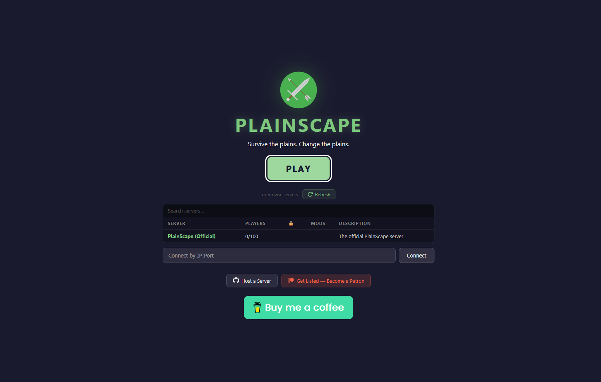
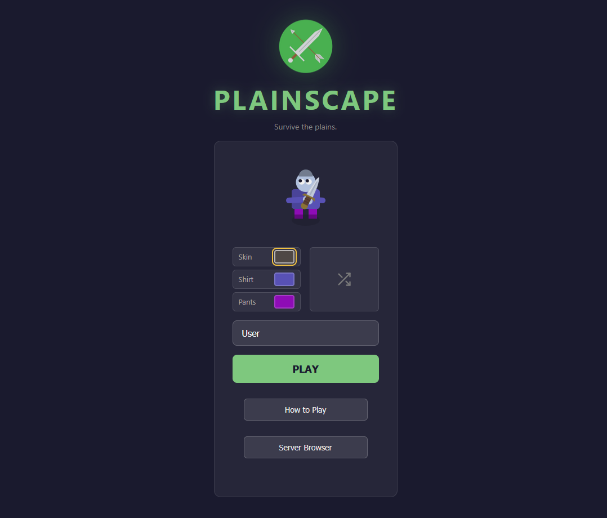
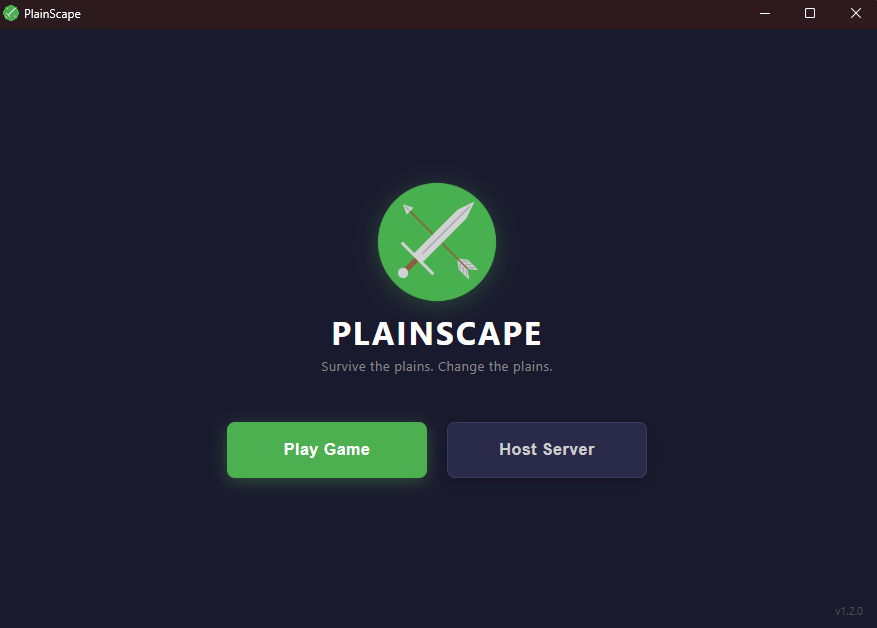
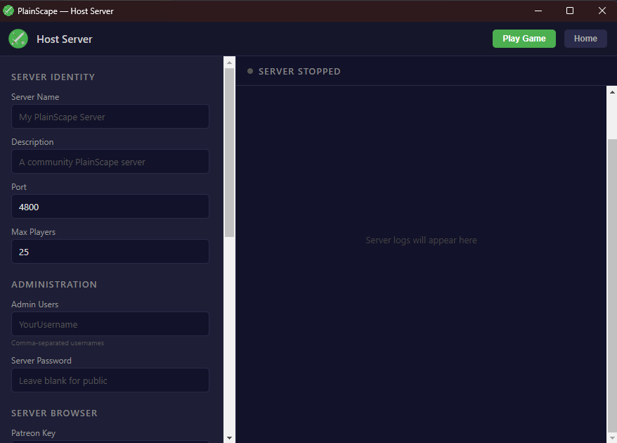
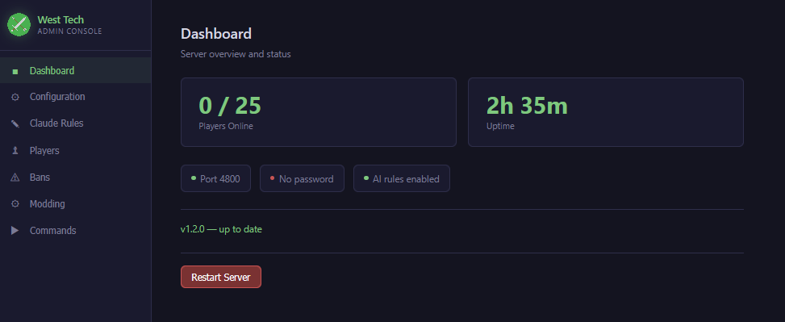
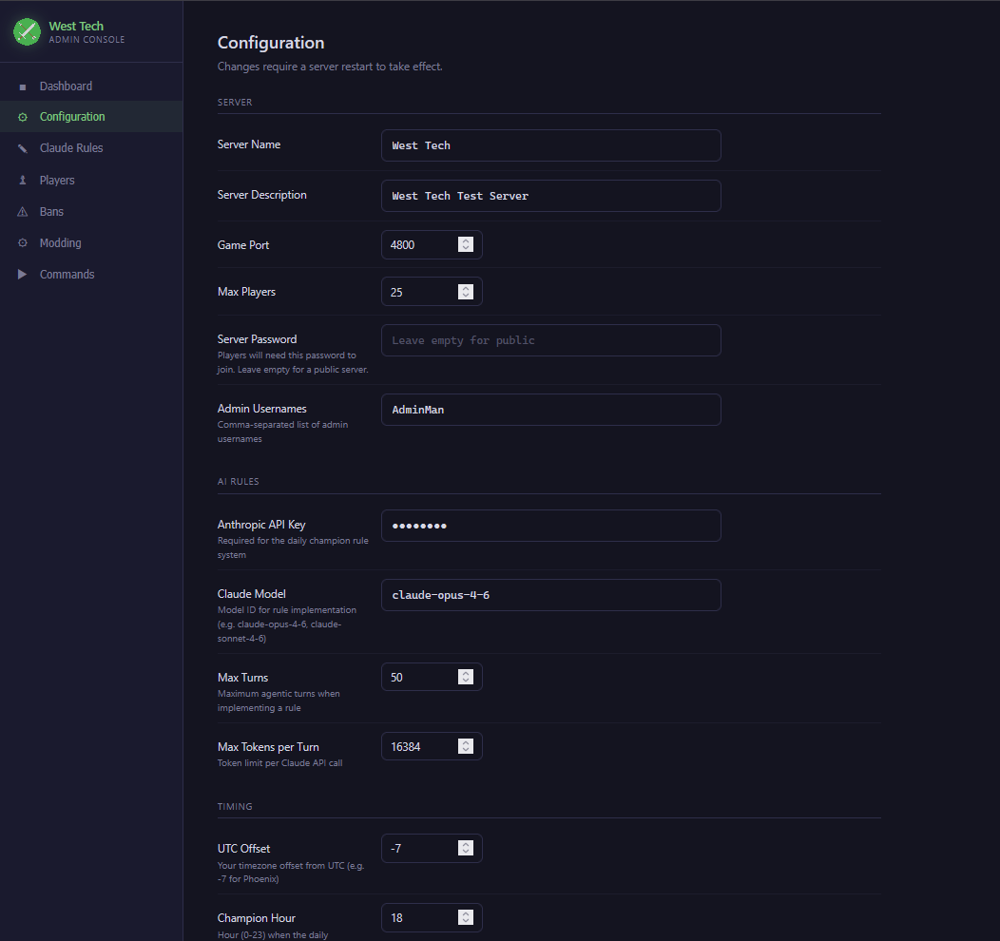
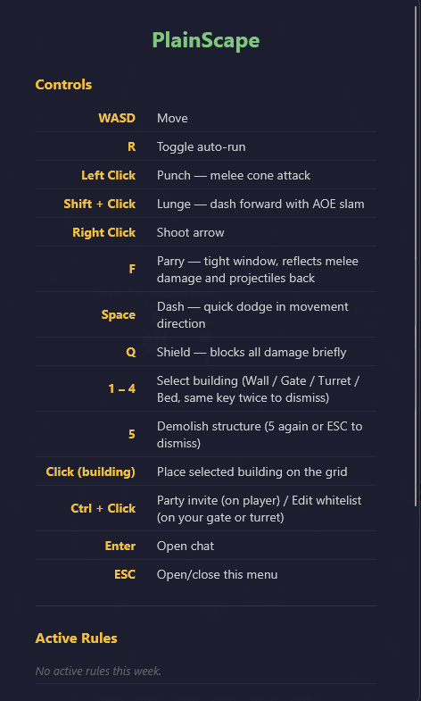
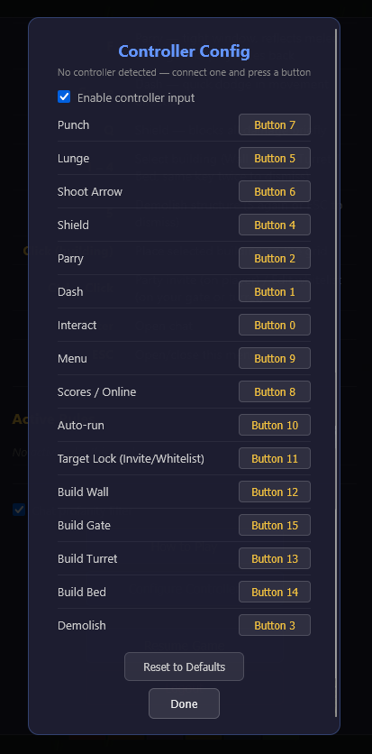

# PlainScape Community Server

**PlainScape** is a real-time multiplayer top-down survival game that runs in your browser. Fight AI enemies, build defenses, and compete for the daily champion title — where the winner gets to add a new rule to the game using AI.



## What is PlainScape?

- **Survive** — Fight lions during the day and ghosts at night. Dawn and dusk are the most dangerous, with both enemy types active.
- **Build** — Place walls, gates, turrets, and beds to create bases. Turrets auto-target enemies and hostile players.
- **Compete** — Earn Source (currency) by exploring, killing enemies, and defeating other players. The player who earns the most Source each day becomes the champion.
- **Change the game** — The daily champion gets to add a new rule to the game. Rules are implemented by Claude AI and can change anything — new enemies, balance tweaks, fun mechanics.
- **Party up** — Form parties to share Source, heal at party beds, and coordinate on the minimap.

## Play Now

- **Official server**: [plainscape.world](https://plainscape.world)
- **Desktop app**: Download from [Releases](https://github.com/chvolk/PlainScape-Community/releases)
- **PWA**: Install from Chrome/Edge address bar for fullscreen app experience





---

## Hosting a Server

### Requirements
- [Node.js 22+](https://nodejs.org/) (LTS recommended)

### Quick Start

1. Download the latest release from [Releases](https://github.com/chvolk/PlainScape-Community/releases)
2. Extract and copy `.env.example` to `.env`
3. Edit `.env` with your settings (see [Configuration](#configuration))
4. Start the server:
   ```bash
   # Linux / macOS
   ./start.sh

   # Windows
   start.bat
   ```
5. Open `http://localhost:4800` in your browser

On first startup, the server installs runtime dependencies and creates a `plainscape.db` SQLite database.

### Desktop App

Download `PlainScape 1.2.0.exe` (Windows) from [Releases](https://github.com/chvolk/PlainScape-Community/releases). It's a portable app — no installation needed. Configure your server, click Start, and play.





---

## Configuration

All settings are in the `.env` file or the admin console Configuration tab.

### Server

| Variable | Default | Description |
|----------|---------|-------------|
| `SERVER_NAME` | `My PlainScape Server` | Name shown in the server browser |
| `SERVER_DESCRIPTION` | *(empty)* | Description shown in the server browser |
| `PORT` | `4800` | Port the server listens on (TCP) |
| `MAX_PLAYERS` | `100` | Maximum concurrent players |
| `SERVER_HOST` | *(auto-detected)* | Your public IP address |
| `SERVER_PASSWORD` | *(empty)* | If set, players must enter this to join |
| `ADMIN_USERS` | *(empty)* | Comma-separated admin usernames (e.g. `Alice,Bob`) |

### Server Browser

Your server can appear in the browser at [plainscape.world](https://plainscape.world).

| Variable | Default | Description |
|----------|---------|-------------|
| `PATREON_KEY` | *(empty)* | Patreon access token — get one at [plainscape.world/api/patreon/authorize](https://plainscape.world/api/patreon/authorize) |
| `DEMO_KEY` | *(empty)* | Alternative to Patreon key for testing (provided by PlainScape admins) |

### AI Rule System

Optional — the game works great without it.

| Variable | Default | Description |
|----------|---------|-------------|
| `ANTHROPIC_API_KEY` | *(empty)* | Your Anthropic API key — enables the daily champion rule system |
| `CLAUDE_RULE_MODEL` | `claude-opus-4-6` | Model for rule implementation |
| `GITHUB_TOKEN` | *(empty)* | GitHub PAT for pushing rule code changes — the repo is auto-forked if not set |
| `GITHUB_REPO` | *(auto-forked)* | Your GitHub repo — auto-created from PlainScape-Community when you provide a `GITHUB_TOKEN` |

### Timing

| Variable | Default | Description |
|----------|---------|-------------|
| `TIMEZONE_UTC_OFFSET` | `-7` | UTC offset (e.g. `-5` for EST, `0` for UTC) |
| `CHAMPION_HOUR` | `18` | Hour (0-23) for daily champion selection |
| `RESET_DAY` | `0` | Weekly reset day (0=Sun, 1=Mon, ... 6=Sat) |
| `RESET_HOUR` | `20` | Hour (0-23) for weekly reset |

### Admin Console

| Variable | Default | Description |
|----------|---------|-------------|
| `ADMIN_PORT` | `4801` | Admin console port (localhost only) |
| `ADMIN_CONSOLE_PASSWORD` | *(empty)* | Optional password for admin console |

---

## Admin Console

Web-based admin panel at `http://127.0.0.1:4801` (localhost only).



- **Dashboard** — Player count, uptime, status, automatic update checker
- **Configuration** — Edit all settings via GUI (no need to edit `.env`)
- **Claude Rules** — Markdown editor for AI guardrails
- **Players** — Search, grant/revoke admin, ban players
- **Bans** — View and remove bans
- **Modding** — Toggle modded flag, promote live → stable, rollback
- **Commands** — Quick reference for all admin chat commands



---

## Admin Commands

Players listed in `ADMIN_USERS` can use these in chat (press Enter):

| Command | Description |
|---------|-------------|
| `/source <amount>` | Give yourself Source |
| `/grantrule <username>` | Grant rule prompt to a player |
| `/rule` | Open rule submission prompt for yourself |
| `/clearrules` | Clear all active rules |
| `/clearsuggestions` | Clear all rule suggestions |
| `/notice <text>` | Add admin notice to the safe zone sign |
| `/clearnotices` | Remove all notices |
| `/dawn` `/day` `/dusk` `/night` | Force time phase |
| `/autotime` | Resume natural day/night cycle |
| `/stag spawn` / `/stag kill` | Spawn or remove the Scorched Stag |
| `/freeuser <username>` | Release a username reservation |
| `/freeall` | Free all usernames and kick all players |
| `/clearmap` | Remove all structures from the map |
| `/weeklyreset` | Perform the weekly reset immediately |
| `/shutdown` | Gracefully stop the server |

---

## Game Mechanics

### Controls



| Key | Action |
|-----|--------|
| WASD | Move |
| Left Click | Punch — melee cone attack |
| Shift + Click | Lunge — dash forward with AOE slam |
| Right Click | Shoot arrow |
| F | Parry — reflects melee damage and projectiles |
| Space | Dash — quick dodge |
| Q | Shield — blocks all damage briefly |
| R | Toggle auto-run |
| 1–4 | Select building (Wall / Gate / Turret / Bed) |
| 5 | Demolish structure |
| Ctrl + Click | Party invite / Edit whitelist |
| Enter | Open chat |
| ESC | Menu |

Full controller support with configurable bindings (ESC → Configure Controller).



### Earning Source

| Source | Amount |
|--------|--------|
| Walking | +1 every 5 seconds |
| Kill Lion | +4 (base) |
| Kill Ghost | +4 (base) |
| Kill Player | +20 (+ victim's unbanked Source) |
| Kill Scorched Stag | +300 (split proportionally by damage) |
| Destroy Building | +5 |
| Dawn Bonus | +2 per Lion kill during Dawn |
| Dusk Bonus | +2 per Ghost kill during Dusk |
| Distance Bonus | +2 per 700 units from safe zone (max +25) |
| Death Consolation | +3 |

### Day/Night Cycle

30-minute loop:
- **Dawn** (5 min) — Lions + Ghosts, +2 bonus per lion kill
- **Day** (10 min) — Lions only
- **Dusk** (5 min) — Lions + Ghosts, +2 bonus per ghost kill
- **Night** (10 min) — Ghosts only

### Enemies

**Lions** (Day & Dawn) — Melee chargers that pounce. They ramp up speed the longer they chase, and prolonged chases attract flanking reinforcements that coordinate as a pack. After pouncing, they briefly crouch — your window to counterattack. Weak to ranged attacks.

**Ghosts** (Night & Dusk) — Ranged kiters that fire homing projectiles. They strafe to dodge and periodically burst-fire two rapid shots. While wandering, ghosts phase out and become intangible. Parried ghost projectiles home onto nearby enemies. Weak to melee.

**Scorched Stag** (World Boss) — Fire-breathing stag with 300 HP. Breathes fire, charges at players, and deals heavy melee damage. Targets whoever dealt the most damage in the last 4 seconds. Drops 300 Source split proportionally among all players who damaged it. HP persists across restarts, resets weekly.

### Buildings

- **Wall** (10 Source) — Solid barrier. Only building that regenerates HP.
- **Gate** (15 Source) — Passable door for you and whitelisted players. Lower HP than walls.
- **Turret** (80 Source) — Auto-targeting cannon with explosive AOE. Enemies aggro turrets that shoot them.
- **Bed** (20 Source) — Heals you and party members. Respawn point. One per player.

### Key Locations

- **Safe Zone** — Green circle at center. No combat or building. Faster movement, passive healing.
- **Buffer Zone** — Yellow ring around safe zone. Combat allowed, building prohibited.
- **The Banker** — Deposit Source for safekeeping. 10% withdrawal fee, minimum 10 Source.
- **The Scribe** — Submit rule suggestions (200 Source) or vote on others (50 Source).

### Parties

Ctrl+click another player to invite. Party members:
- Appear blue on minimap with blue names
- Share Source (earner keeps 40%, rest split evenly)
- Can heal at each other's beds
- Up to 10 players per party

### Stats

Spend 100 Source per level (max 25) on: Move Speed, Melee Knockback, Melee Range, Projectile Speed, Projectile Range, Lunge AOE, Lunge Distance, Shield Duration, Dash Distance. Stats are lost if you become champion (unless you adopt the community's top suggestion).

### The Rule System

1. Players earn Source throughout the day
2. Once per day in the evening, the top earner becomes champion
3. The champion can write their own rule (lose all Source + stats) or adopt the top community suggestion (lose Source, keep stats)
4. Claude AI implements the rule by modifying game code
5. Rules last until the weekly reset

### Weekly Reset

At the configured day/hour (default Sunday 8pm):
- All Source and stats reset to zero
- All active rules cleared (code reverts to stable branch)
- Scorched Stag respawns
- Username reservations persist (6-week TTL)

---

## GitHub Setup for Rules & Modding

The AI rule system needs a GitHub repository to store code changes.

### Automatic Setup (Recommended)

1. Create a [GitHub Personal Access Token](https://github.com/settings/tokens) with `repo` scope
2. Set `GITHUB_TOKEN` in your `.env` or admin console
3. **That's it** — the server automatically forks `PlainScape-Community` into your GitHub account and sets up the branches

### Manual Setup

1. Fork [chvolk/PlainScape-Community](https://github.com/chvolk/PlainScape-Community)
2. Create a PAT with `repo` scope
3. Set both `GITHUB_TOKEN` and `GITHUB_REPO=yourname/PlainScape-Community` in `.env`

### How It Works

- **Daily rules** are committed to your `community/{code}/live` branch
- **Weekly resets** revert live → stable
- **Rollback** via admin console to your stable, community main, or any commit
- **Promote Live → Stable** to persist custom changes across resets

---

## Port Forwarding

For players outside your LAN:

1. Open your router admin (usually `192.168.1.1`)
2. Add a port forwarding rule: external port 4800 → internal port 4800, TCP, your local IP
3. Share your public IP + port (find it at [whatismyip.com](https://whatismyip.com))

---

## Updates

- **Admin Console** — Dashboard shows update banner with changelog and one-click update
- **Desktop App** — Home screen shows update notification
- **Manual** — Download latest from [Releases](https://github.com/chvolk/PlainScape-Community/releases), copy `.env` and `plainscape.db` to the new folder

---

## Troubleshooting

| Problem | Solution |
|---------|----------|
| Can't detect public IP | Set `SERVER_HOST` in `.env` manually |
| Server not in browser | Need valid `PATREON_KEY` or `DEMO_KEY` |
| Players can't connect | Forward port 4800 TCP in your router |
| Rule system disabled | Set `ANTHROPIC_API_KEY` in `.env` |
| Admin console not loading | Only accessible at `http://127.0.0.1:4801` (localhost) |

---

## Links

- **Play**: [plainscape.world](https://plainscape.world)
- **Releases**: [GitHub Releases](https://github.com/chvolk/PlainScape-Community/releases)
- **Privacy Policy**: [plainscape.world/privacy](https://plainscape.world/privacy)
- **Terms**: [plainscape.world/terms](https://plainscape.world/terms)
- **Support**: [Buy me a coffee](https://buymeacoffee.com/PlainScape)
- **Patreon**: [patreon.com/PlainScape](https://www.patreon.com/c/PlainScape)
